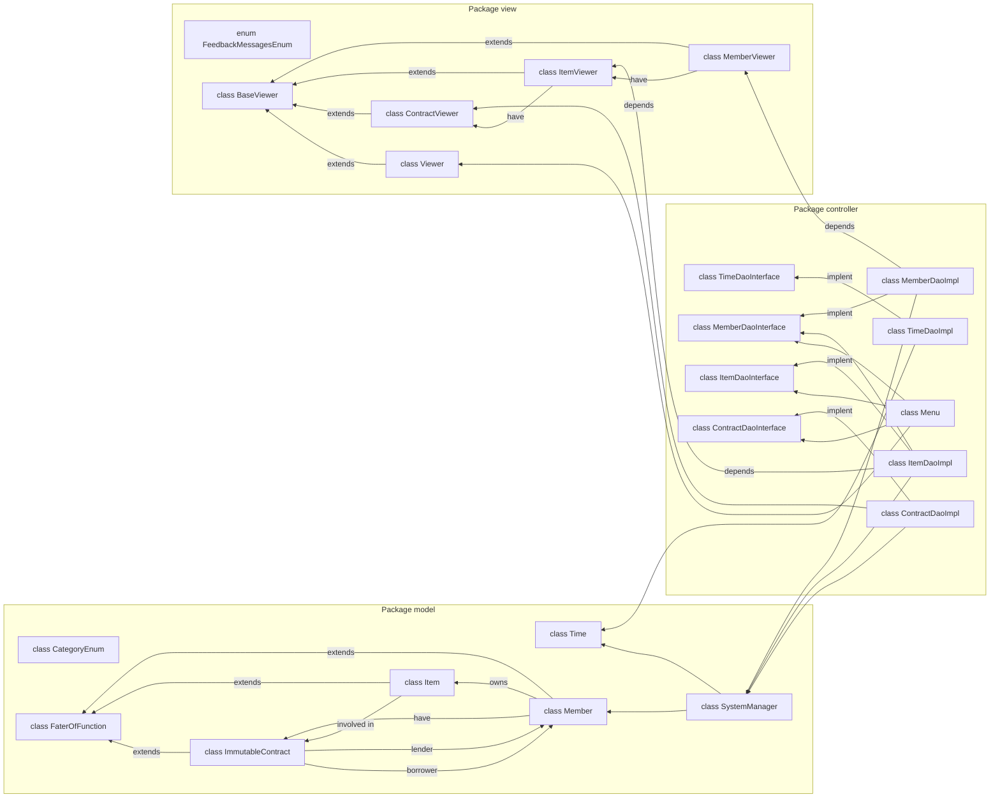
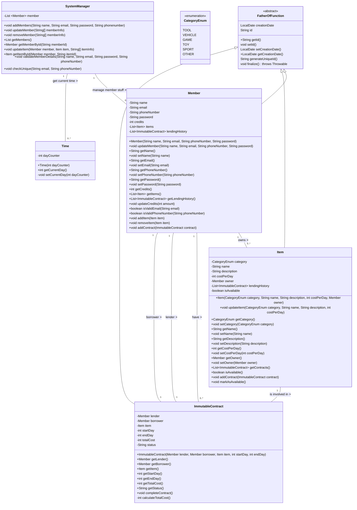

# packages-diagramg.



# Class diagram packages model.



# Class diagram package controller
```mermaid
classDiagram

    %% TimeDaoInterface and TimeDaoImpl
    class TimeDaoInterface {
        <<Interface>> 
        +int getCurrentDay()
        +void advanceDay()
        +void advanceDays(int days)
    }
    
    class TimeDaoImpl {
        -int dayCounter
        -Time time
        +void advanceDay()
        +void advanceDays(int numberOfDays)
        +int getCurrentDay()
    }
    TimeDaoInterface <|.. TimeDaoImpl

    %% MemberDaoInterface and MemberDaoImpl
    class MemberDaoInterface {
        <<Interface>> 
        +void addMember(String name, String email, String phoneNumber, String password)
        +void modifyMember(String memberId, String name, String email, String phoneNumber, String password)
        +void deleteMember(String memberId, String password)
        +void checkUnique(String email, String phoneNumber)
        +Member showSpecificMemberInfo(String memberId)
        +Member getMemberById(String memberId)
        +List~Member~ getMembers()
        +List~Item~ getAvilbaleItems()
    }
    
    class MemberDaoImpl {
        -List~Member~ members
        +void addMember(String name, String email, String phoneNumber, String password)
        +void modifyMember(String memberId, String name, String email, String phoneNumber, String password)
        +void deleteMember(String memberId, String password)
        +void checkUnique(String email, String phoneNumber)
        +Member showSpecificMemberInfo(String memberId)
        +Member getMemberById(String memberId)
        +List~Member~ getMembers()
        +List~Item~ getAvilbaleItems()
    }
    MemberDaoInterface <|.. MemberDaoImpl


    %% ItemDaoInterface and ItemDaoImpl
    class ItemDaoInterface {
        <<Interface>> 
        +void createItem(String memberId, CategoryEnum category, String name, String description, int costPerDay)
        +void modifyItem(String memberId, String itemId, CategoryEnum category, String name, String description, int costPerDay)
        +void deleteItem(String memberId, String itemId)
        +Item viewItem(String memberId, String itemId)
        +List~Item~ getItemsByMember(String memberId)
    }
    
    class ItemDaoImpl {
        -MemberDaoInterface memberDao
        +void createItem(String memberId, CategoryEnum category, String name, String description, int costPerDay)
        +void modifyItem(String memberId, String itemId, CategoryEnum category, String name, String description, int costPerDay)
        +void deleteItem(String memberId, String itemId)
        +Item viewItem(String memberId, String itemId)
        +List~Item~ getItemsByMember(String memberId)
    }
    ItemDaoImpl ..|>  ItemDaoInterface
    ItemDaoImpl "1"-- "1" MemberDaoInterface : belong to

    %% ContractDaoInterface and ContractDaoImpl
    class ContractDaoInterface {
        <<Interface>> 
        +void createContract(Member lender, Member borrower, Item item, int startDay, int endDay)
        +boolean isItemAvailableToLend(Item item)
        +boolean isEnoughFundsToBorrow(int borrowerFunds, int itemCost)
    }
    
    class ContractDaoImpl {
        -TimeDaoInterface timeDao
        +void createContract(Member lender, Member borrower, Item item, int startDay, int endDay)
        +boolean isItemAvailableToLend(Item item)
        +boolean isEnoughFundsToBorrow(int borrowerFunds, int itemCost)
    }
    ContractDaoInterface <|.. ContractDaoImpl

    class Menu {
        -MemberDaoInterface memberDao
        -ItemDaoInterface itemDao
        -ContractDaoInterface contractDao
        -Viewer viewer
        +void mainMenu()
        -void memberMenu()
        -void contractMenu()
        -void itemMenu()
    }
    
    Menu "1"-- "0..*" MemberDaoInterface : have member menu 
    Menu "1"-- "0..*" ItemDaoInterface : have item menu
    Menu "1"-- "0..*" ContractDaoInterface : have contact 
    
````


# Class diagram package view.
```mermaid
classDiagram
    class Baseviewer {
        <<abstract>>
        String promptForInput(String message)
        int promptForInt(String message)
        void waitForUserInput()
        +void displayFeedback(boolean success, String successMsg, String errorMsg)
    }

    class enum FeedbackMessage {
        +enum FeedbackMessage
        +String getMessage()
    }   
    class Viewer {
        String promptForInput(String message)
        int promptForInt(String message)
        void waitForUserInput()
        void displayFeedback(boolean success, String successMsg, String errorMsg)
    }
    class MemberViewer {
        -ItemViewer itemViewer
        +void createMember()
        +void editMemberInfo()
        +void deleteMember()
        +void specificMemberFullInfo()
        +void displayMembersOverview()
        +void displayMembersWithDetailedItems()
        +void getAvilbaleItems()
        +void findMember(List<Member> members)
    }

    class ItemViewer {
        -ContractViewer contractViewer;
        +void viewItems(Member member)
        +void viewAvailableItems(List<Item> items)
        +void editIteminfo()
        +void addNewItem()
        +void deleteItem()
        -void displayItemInfo(Item item)
    }

    class ContractViewer {
        +String[] createContract()
        +void viewContract(Item item)

    }
    MemberViewer "1"--"0..*"  ItemViewer 
    ItemViewer  "1"--"0..*"  ContractViewer 
    Baseviewer <|-- Viewer
    Baseviewer <|-- ItemViewer
    Baseviewer <|-- ContractViewer
    Baseviewer <|-- MemberViewer

   
```


# SequenceDiagram

```mermaid
sequenceDiagram
    participant App as App 
    participant Menu as Controller <br/> Menu
    participant MC as Controller <br/> MemberDaoImpl 
    participant MV as Viewer <br/> MemberViewer
    participant SM as  Model <br/> SystemManager
    participant M1 as exixting member <br/> Member1
    participant M1 as exixting member <br/> Member1
    participant M as Model <br/> Member
    
    %% Scenario: Add a new third member with user input and database interaction
    App->> Menu: mainMenu()
    Menu->>Menu: memberMenu()
    Menu->>MC: createMember()
    MC->>+MV: prumpt for createMember()
    MV-->>-MC: return a String[] of member info
    MC->>+SM: addMember(name, email, phoneNumber, password) 
    SM->>SM: validieteMemberDetails(name, email, phoneNumber, password) 
    SM->>M: Member(name, email, phoneNumber, password)
    SM->>SM: store the member in members list
    SM-->>-MC: member added successfully
    MC->>MV: Display feedback

````


# ObjectDiagram


    