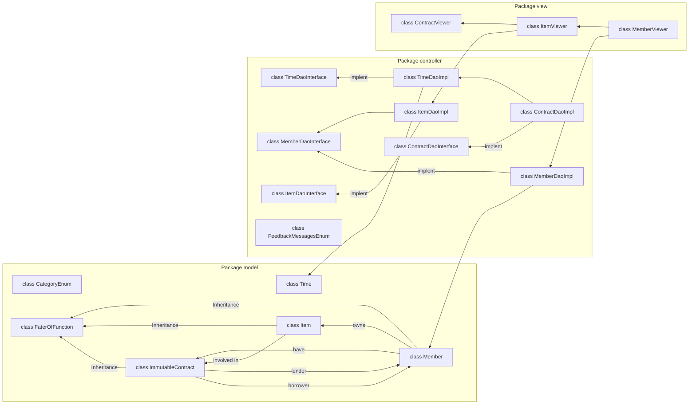
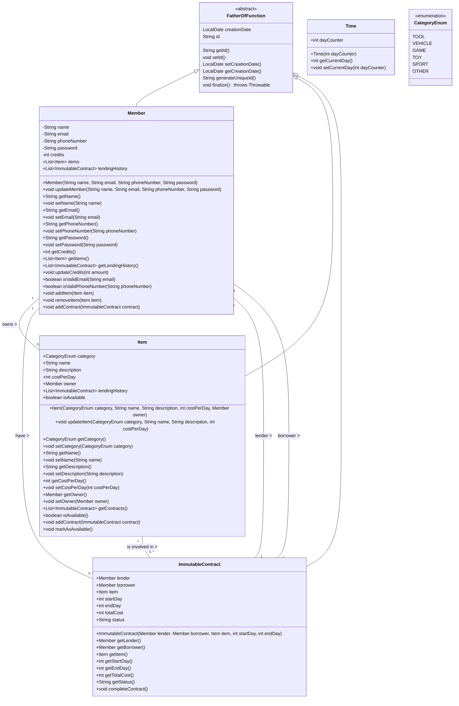

# packages-diagramg.



# Class diagram packages model.



# Class diagram package controller
```mermaid
classDiagram

    %% TimeDaoInterface and TimeDaoImpl
    class TimeDaoInterface {
        <<Interface>> 
        +int getCurrentDay()
        +void advanceDay()
        +void advanceDays(int days)
    }
    
    class TimeDaoImpl {
        -int dayCounter
        -Time time
        +void advanceDay()
        +void advanceDays(int numberOfDays)
        +int getCurrentDay()
    }
    TimeDaoInterface <|.. TimeDaoImpl

    %% MemberDaoInterface and MemberDaoImpl
    class MemberDaoInterface {
        <<Interface>> 
        +void addMember(String name, String email, String phoneNumber, String password)
        +void modifyMember(String memberId, String name, String email, String phoneNumber, String password)
        +void deleteMember(String memberId, String password)
        +void checkUnique(String email, String phoneNumber)
        +Member showSpecificMemberInfo(String memberId)
        +Member getMemberById(String memberId)
        +List~Member~ getMembers()
        +List~Item~ getAvilbaleItems()
    }
    
    class MemberDaoImpl {
        -List~Member~ members
        +void addMember(String name, String email, String phoneNumber, String password)
        +void modifyMember(String memberId, String name, String email, String phoneNumber, String password)
        +void deleteMember(String memberId, String password)
        +void checkUnique(String email, String phoneNumber)
        +Member showSpecificMemberInfo(String memberId)
        +Member getMemberById(String memberId)
        +List~Member~ getMembers()
        +List~Item~ getAvilbaleItems()
    }
    MemberDaoInterface <|.. MemberDaoImpl

    %% ItemDaoInterface and ItemDaoImpl
    class ItemDaoInterface {
        <<Interface>> 
        +void createItem(String memberId, CategoryEnum category, String name, String description, int costPerDay)
        +void modifyItem(String memberId, String itemId, CategoryEnum category, String name, String description, int costPerDay)
        +void deleteItem(String memberId, String itemId)
        +Item viewItem(String memberId, String itemId)
        +List~Item~ getItemsByMember(String memberId)
    }
    
    class ItemDaoImpl {
        -MemberDaoInterface memberDao
        +void createItem(String memberId, CategoryEnum category, String name, String description, int costPerDay)
        +void modifyItem(String memberId, String itemId, CategoryEnum category, String name, String description, int costPerDay)
        +void deleteItem(String memberId, String itemId)
        +Item viewItem(String memberId, String itemId)
        +List~Item~ getItemsByMember(String memberId)
    }
    ItemDaoImpl ..|>  ItemDaoInterface
    ItemDaoImpl --> MemberDaoInterface

    %% ContractDaoInterface and ContractDaoImpl
    class ContractDaoInterface {
        <<Interface>> 
        +void createContract(Member lender, Member borrower, Item item, int startDay, int endDay)
        +boolean isItemAvailableToLend(Item item)
        +boolean isEnoughFundsToBorrow(int borrowerFunds, int itemCost)
    }
    
    class ContractDaoImpl {
        -TimeDaoInterface timeDao
        +void createContract(Member lender, Member borrower, Item item, int startDay, int endDay)
        +boolean isItemAvailableToLend(Item item)
        +boolean isEnoughFundsToBorrow(int borrowerFunds, int itemCost)
    }
    ContractDaoInterface <|.. ContractDaoImpl
    TimeDaoInterface <-- ContractDaoImpl

````


# Class diagram package view.
```mermaid
classDiagram
    class MemberViewer {
        +void mainMenu()
        +void createMember()
        +void editMemberInfo()
        +void deleteMember()
        +void specificMemberFullInfo()
        +void displayMembersOverview()
        +void displayMembersWithDetailedItems()
        +void getAvilbaleItems()
    }

    class ItemViewer {
        +void viewItems(Member member)
        +void viewAvailableItems(List<Item> items)
        +void editIteminfo()
        +void addNewItem()
        +void deleteItem()
    }

    class ContractViewer {
        +void viewContract(Item item)
    }
    MemberViewer  -->  ItemViewer
    ItemViewer  --> ContractViewer

   
```


# SequenceDiagram

```mermaid
sequenceDiagram
    participant MV as MemberViewer
    participant MC as MemberDaoImpl
    participant M as Member

    %% Scenario: Add a new third member with user input and database interaction
    MV->>MV: prompt for name, email, password, phoneNumber
    MV->>MC: createMember(name, email, phoneNumber, password)  %% Send data to controller

    MC->>M: addMember(name, email, phoneNumber, password)   %% Controller calls Model to add new member
    M-->>MC: return new Member object with memberId, name, email, creationDate, password.  %% Member is created and returned to Controller

    MC->>MC: store member data in list of members  %% Controller handles saving the new member
    
    MC-->>MV: return a copy of Member object to view
    MV->>MV: display member details to user
````

    